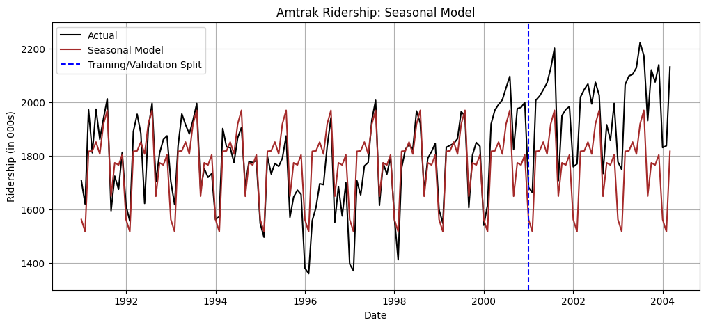
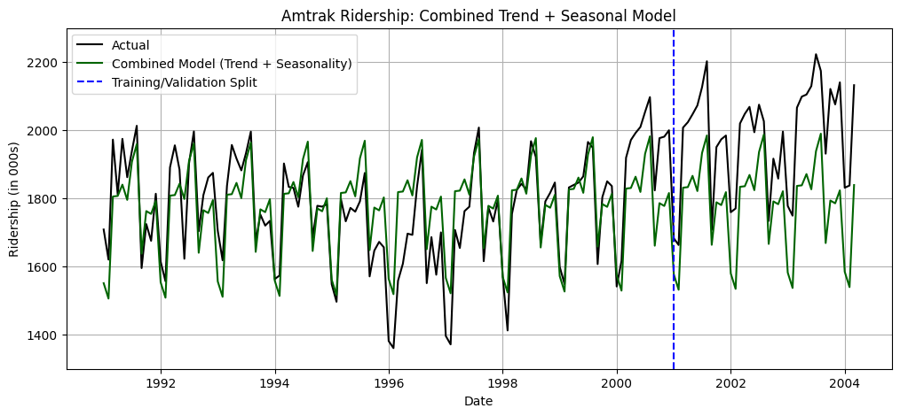

# Amtrak Ridership — Regression-Based Forecasting Models

## 📘 Overview

This project applies regression and seasonal time series modeling to forecast Amtrak ridership over a 13-year period.
Multiple model types were tested — **linear, exponential, polynomial, seasonal, and combined trend + seasonal** — to identify ridership patterns, evaluate model performance, and interpret the dominant seasonal trends.

The goal was to translate raw time-series data into actionable forecasting insights using Python.

---

## 🧠 Key Objectives

* Build interpretable regression models to predict monthly ridership.
* Quantify trend and seasonality effects.
* Compare model performance using R² and diagnostic plots.
* Communicate insights through clean visualizations and written interpretation.

---

## 🧰 Tools & Libraries

* **Python** (Jupyter / Google Colab)
* **Pandas** and **NumPy** for data preprocessing
* **Statsmodels** for OLS regression and time-series modeling
* **Matplotlib** for visualizations
* **Scikit-learn** for evaluation utilities 

---

## 📂 Repository Structure

```
amtrak-ridership-forecasting/
├── README.md
├── data/
│   ├── Amtrak.csv
│   └── Amtrak_Ridership_Colab.pdf
├── notebooks/
│   └── Amtrak_Ridership_Forecasting.ipynb
└── results/
    ├── linear/
    │   ├── linear_model.png
    │   └── linear_errors.png
    ├── exponential/
    │   ├── exponential_model.png
    │   └── exponential_errors.png
    ├── polynomial/
    │   ├── polynomial_model.png
    │   └── polynomial_errors.png
    ├── seasonal/
    │   ├── seasonal_model.png
    │   └── seasonal_errors.png
    └── combined/
        ├── combined_model.png
        └── combined_errors.png

```

---

## 📊 Results Summary

| Model                     | Description                      | Key Metric                |
| ------------------------- | -------------------------------- | ------------------------- |
| Linear                    | Simple trend line                | Weak fit (R² ≈ 0.006)     |
| Exponential               | Log-linear growth                | Minimal improvement       |
| Polynomial                | Captures curvature               | R² ≈ 0.174                |
| Seasonal                  | Monthly dummy variables          | **Best fit (R² ≈ 0.647)** |
| Combined Trend + Seasonal | Adds linear trend to seasonality | R² ≈ 0.649                |

### Interpretation

* Strong seasonal pattern dominates ridership variation.
* Peaks in **March–August**, lowest in **January–February**.
* After controlling for seasonality, long-term trend is relatively stable.

---

## 📈 Visualizations

Example outputs (see full set under `/results/`):



---

## 📘 Insights

* Seasonal variation explains most of the ridership change, suggesting allocation and scheduling strategies should follow monthly cycles.
* Demonstrates ability to conduct complete analytical workflow — data cleaning, modeling, visualization, and interpretation.
* Strong foundation for applying regression-based forecasting in business analytics and demand planning contexts.

---

